# Spare room sharing website (Colegi de apartament)

A website where people can share spare rooms and save on rent built with FastAPI, Jinja, AlpineJS and MongoDB. User can create an account (email+password) post spare rooms and receive messages from other interested users. This can be used as a boilerplate for new apps has a ready to deploy setup with SSL from Caddy, easy to develop, extend.

## Quickstart

- `virtualenv .venv`
- `source ./venv/bin/activate`
- `make up` - start the website in docker and checkout `http://colegideapartament.localhost` url in the browser (has hot reload if `DEBUG=1` in prod set `DEBUG=0` in `.env` file);
- `make re` - restart app website container;
- `make down` - shutdown docker stack;
- see more docker commands in `Makefile`;
- `admin.softgata.localhost` - you will see mongo-express ui to see data from MongoDB;

For deploying to a VPS
- `scp .env.deploy root@IP:~/multisite-romarg` - copy file to server and reverse;
- `scp -r root@IP:~/multisite-romarg/storage ~/Documents/multisite-romarg/`;
- update `.env` file with secure passwords;
- rename `Caddyfile.deploy` to `Caddyfile` and update your email on which you've registered the domain;
- the difference between `docker-compose.yml` and `docker-compose.deploy.yml` is that in the .deploy file ports for web app and DB are not exposed.

## How it works?

User can create an account (email+password).

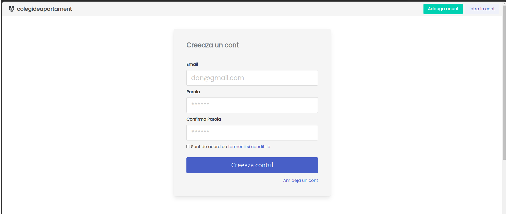

User logs into his account:

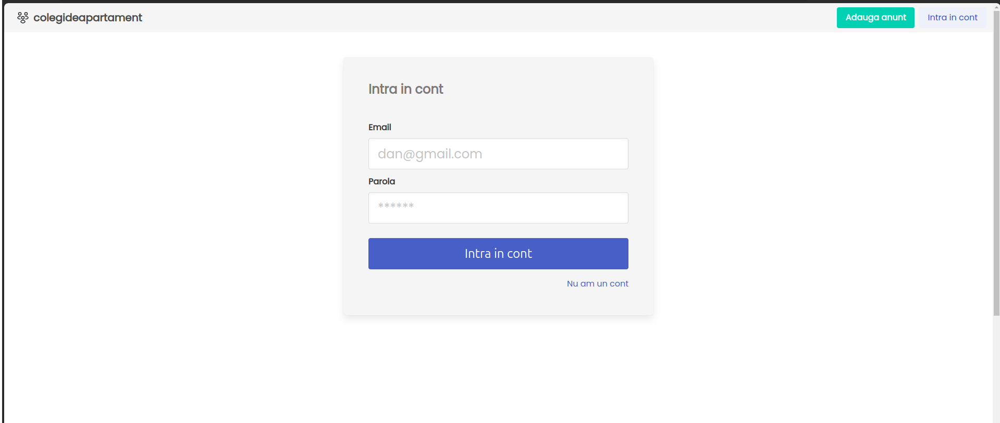

User updates his account by clicking `Actualizeaza cont` (Update account) button

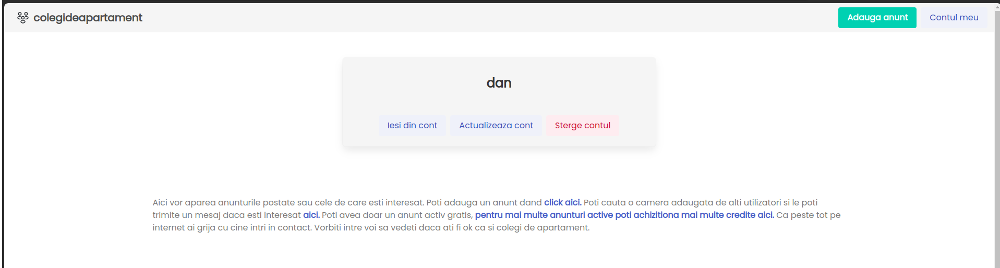

On update account user can add his full name, a few words about himself and a profile picture.

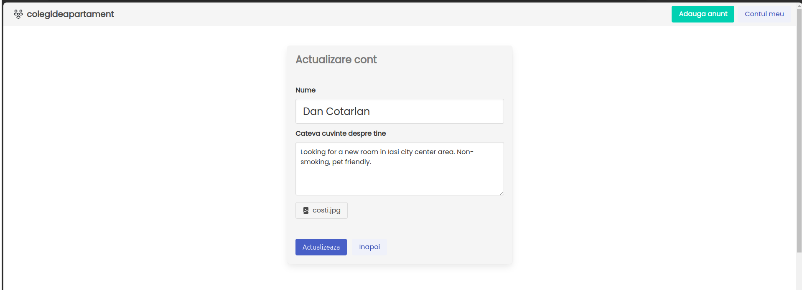

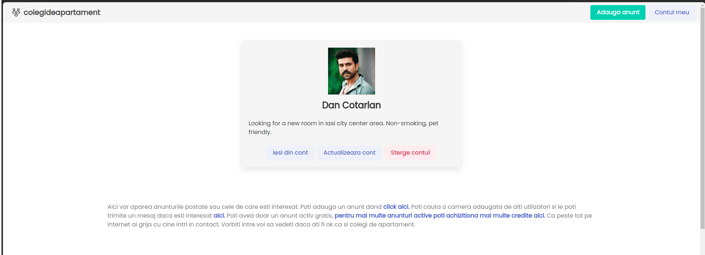

After he updates his profile he can add a listing by clicking `Adauga anunt` (Add listing) button from top right corner.

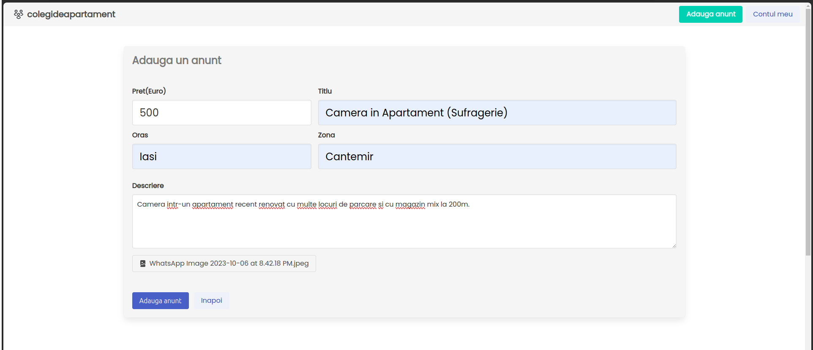

The user will be able to see in his account the listings he added (only one listing per month is allowed on free plan). 

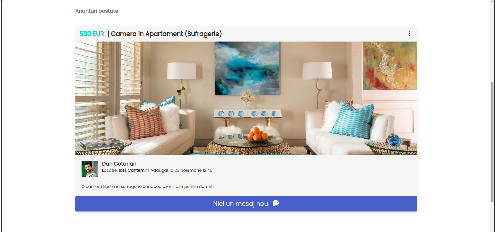

Listings will be viewed/searched by other users and if they are interested in a particular listing they will be able to send a message to listing poster by clicking the `Trimite mesaj` (Send message) button. 

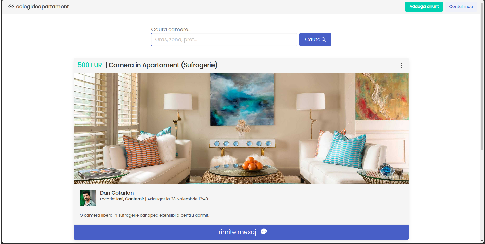

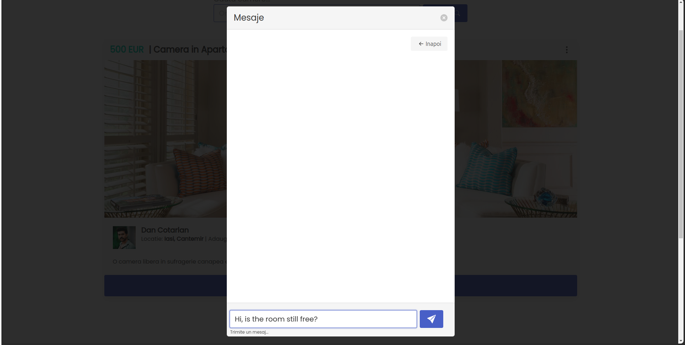

The listing poster will be able to see messages on the listing he posted. Messaging is pretty rudimentary (not websockets), but it does the job. Here the poster can see the list of messages received from other interested users. 

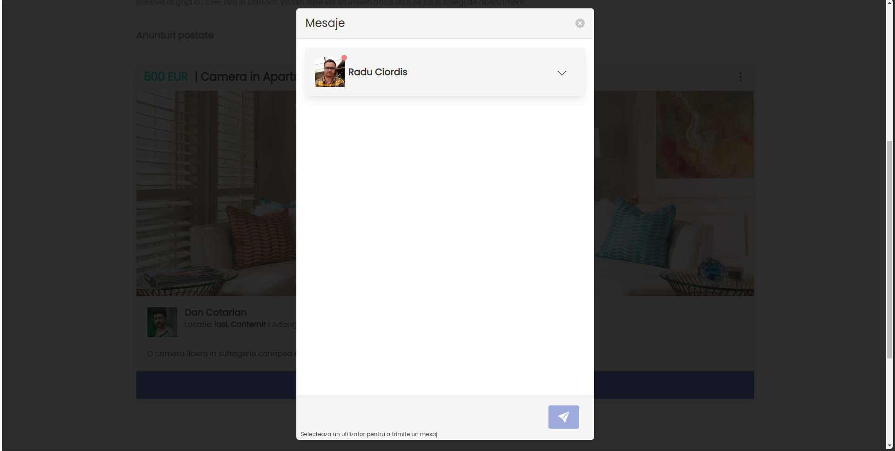

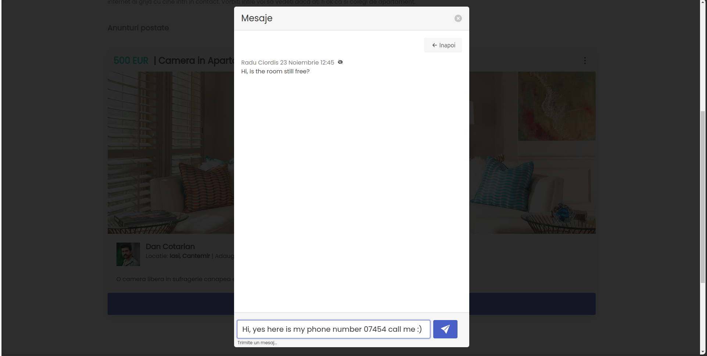

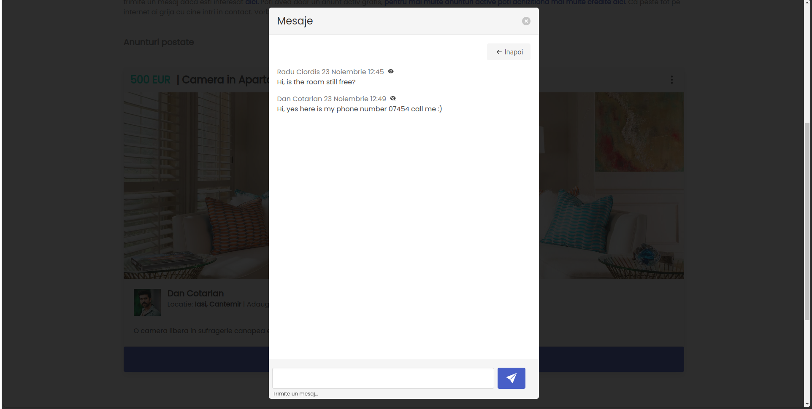

And that's pretty much it. 
I've had a few users on the app while it was running, but not enough to be worth spending more time on it.

Here are some todos if you want to take this further:
- Login with facebook/google (make onboarding easier);
- Improve SEO by updating links (link to posts are uuids, but they should include city, region etc);
- Improve messaging with websockets;
- Integrate a landing page with blog posts (for SEO);

